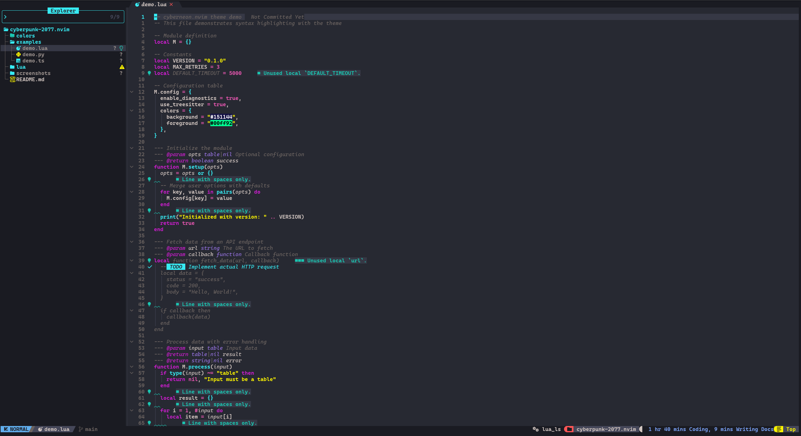
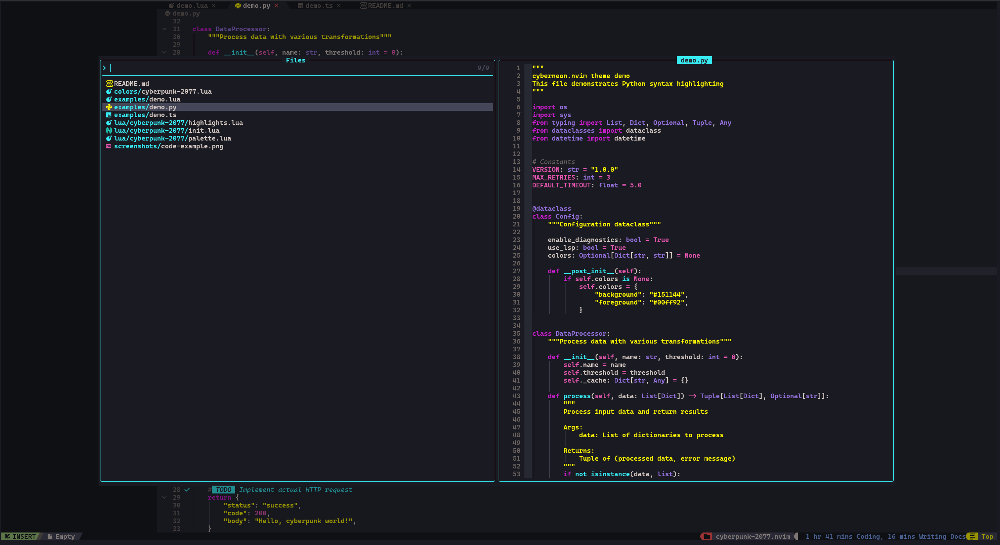

# Cyberpunk 2077 Theme for Neovim

A dark Neovim colorscheme inspired by the Cyberpunk 2077 color palette.

This theme was fully created by [Claude](https://claude.ai), Anthropic's AI assistant.

## Screenshots
 


## Color Palette

| Color | Hex | Preview | Usage |
|-------|-----|---------|-------|
| Raisin Black | `#272932` |  | Background |
| Blood Red | `#710000` |  | Dark red accents |
| Rich Lemon | `#FDF500` |  | Strings, warnings |
| Keppel | `#1AC5B0` |  | Functions |
| Electric Blue | `#37EBF3` |  | Keywords, UI elements |
| Blushing Purple | `#9370DB` |  | Types |
| Frostbite | `#E455AE` |  | Constants, operators |
| Steel Pink | `#CB1DCD` |  | Keywords |
| Pale Silver | `#D1C5C0` |  | Foreground text |

## Installation

### [lazy.nvim](https://github.com/folke/lazy.nvim)

```lua
{
  "followLemmi/cyberpunk-2077.nvim",
  lazy = false,
  priority = 1000,
  config = function()
    require("cyberpunk-2077").setup({
      -- your configuration here
    })
    vim.cmd.colorscheme("cyberpunk-2077")
  end,
}
```

### [packer.nvim](https://github.com/wbthomason/packer.nvim)

```lua
use {
  "followLemmi/cyberpunk-2077.nvim",
  config = function()
    require("cyberpunk-2077").setup()
    vim.cmd.colorscheme("cyberpunk-2077")
  end,
}
```

## Configuration

```lua
require("cyberpunk-2077").setup({
  transparent = false,       -- Enable transparent background
  italic_comments = true,    -- Make comments italic
  dim_inactive = false,      -- Dim inactive windows
  lualine_bold = true,       -- Bold mode indicator in lualine
})

vim.cmd.colorscheme("cyberpunk-2077")
```

## Lualine Integration

```lua
require("lualine").setup({
  options = {
    theme = require("cyberpunk-2077").lualine(),
  },
})
```

## Supported Plugins

- [Treesitter](https://github.com/nvim-treesitter/nvim-treesitter)
- [LSP Diagnostics](https://neovim.io/doc/user/lsp.html)
- [Telescope](https://github.com/nvim-telescope/telescope.nvim)
- [Neo-tree](https://github.com/nvim-neo-tree/neo-tree.nvim)
- [nvim-cmp](https://github.com/hrsh7th/nvim-cmp)
- [GitSigns](https://github.com/lewis6991/gitsigns.nvim)
- [Indent Blankline](https://github.com/lukas-reineke/indent-blankline.nvim)
- [nvim-notify](https://github.com/rcarriga/nvim-notify)
- [which-key.nvim](https://github.com/folke/which-key.nvim)
- [lazy.nvim](https://github.com/folke/lazy.nvim)
- [mason.nvim](https://github.com/williamboman/mason.nvim)
- [bufferline.nvim](https://github.com/akinsho/bufferline.nvim)
- [lualine.nvim](https://github.com/nvim-lualine/lualine.nvim)
- [noice.nvim](https://github.com/folke/noice.nvim)
- [snacks.nvim](https://github.com/folke/snacks.nvim) (picker, explorer)

## License

MIT
